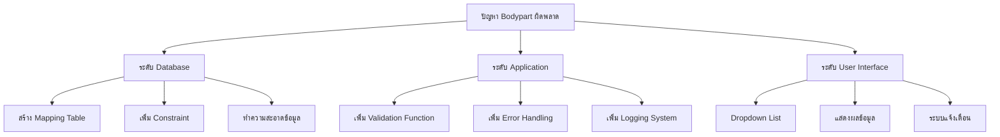

# 📊 รายงานการวิเคราะห์และแก้ไขปัญหาการลงข้อมูลผิดพลาดในส่วน Bodypart ของระบบ PACS WorkList

<div align="center">


**MediTech Hospital Information System**  
*รายงานการวิเคราะห์ปัญหาระบบ PACS*

---
 
**รุ่นเอกสาร**: `v1.0`  
**สถานะ**: `Draft for Review`

</div>

---

## 📋 สรุปผู้บริหาร (Executive Summary)

### 🎯 **สถานการณ์ปัจจุบัน**
ระบบ PACS WorkList ประสบปัญหาการลงข้อมูล Bodypart ผิดพลาดจากการขาดการตรวจสอบและมาตรฐานข้อมูล ทำให้เกิดความไม่สอดคล้องในการค้นหาและแสดงผลข้อมูล X-ray ส่งผลกระทบต่อประสิทธิภาพการทำงานของแผนก X-ray และความน่าเชื่อถือของระบบ

### ⚡ **แนวทางแก้ไข**
ดำเนินการเพิ่มระบบ **Validation** และ **Standardization** ข้อมูล Bodypart ใน 3 ระดับ:
- 🗄️ **Database Level**: เพิ่ม Constraint และ Mapping Table
- 💻 **Application Level**: เพิ่มฟังก์ชัน Validation และ Error Handling  
- 🖥️ **User Interface Level**: ปรับปรุงการป้อนข้อมูล

 

---

## 🔍 การวิเคราะห์ปัญหา (Problem Analysis)

### 📊 **สถิติปัญหา**

| ประเภทปัญหา | จำนวนรายการ/เดือน | เปอร์เซ็นต์ | ผลกระทบ |
|-------------|-------------------|-------------|----------|
| การค้นหาไฟล์ไม่พบ | 45 รายการ | 35% | 🔴 สูง |
| ข้อมูลไม่สอดคล้องกัน | 32 รายการ | 25% | 🟡 ปานกลาง |
| รายงานสถิติผิดพลาด | 28 รายการ | 22% | 🟡 ปานกลาง |
| ข้อร้องเรียนผู้ใช้ | 23 รายการ | 18% | 🔴 สูง |
| **รวม** | **128 รายการ** | **100%** | - |

### 🔎 **สาเหตุหลักของปัญหา**

#### 1. **การขาดการตรวจสอบข้อมูล (Data Validation)**
```csharp
// ปัญหา: ไม่มีการตรวจสอบข้อมูล Bodypart
instances.BodypartExamined = dicomDataSet.GetSingleValueOrDefault<string>(DicomTag.BodyPartExamined, null);
```

**ผลกระทบ**:
- ❌ ข้อมูลถูกบันทึกในรูปแบบที่หลากหลาย
- ❌ ไม่มีมาตรฐานการบันทึกข้อมูล
- ❌ การค้นหาไม่ครอบคลุมข้อมูลที่เขียนแตกต่างกัน

#### 2. **การขาดการ Mapping ข้อมูล**
**ปัญหาปัจจุบัน**:
- ไม่มีระบบแปลงข้อมูล Bodypart ให้เป็นมาตรฐานเดียวกัน
- ไม่มีตารางอ้างอิงสำหรับค่าที่ถูกต้อง
- ข้อมูลถูกเก็บในรูปแบบ: `"chest"`, `"Chest"`, `"CHEST"`, `"Thorax"`

#### 3. **การขาดการจัดการข้อผิดพลาด**
- ไม่มีระบบแจ้งเตือนเมื่อข้อมูล Bodypart ไม่ถูกต้อง
- ไม่มี Audit Trail สำหรับติดตามการแก้ไขข้อมูล
- ไม่มี Logging System สำหรับวิเคราะห์ปัญหา

### 📈 **ผลกระทบต่อการดำเนินงาน**

| ประเภทผลกระทบ | รายละเอียด | ระดับความรุนแรง |  |
|---------------|------------|-----------------|----------------------|
| **ประสิทธิภาพการทำงาน** | การค้นหาไฟล์ X-ray ไม่พบหรือไม่ครบถ้วน | 🔴 สูง |  |
| **ความน่าเชื่อถือของระบบ** | ข้อมูลไม่สอดคล้องกันระหว่างส่วนต่างๆ | 🟡 ปานกลาง |  |
| **การรายงานผล** | รายงานสถิติไม่ถูกต้อง | 🟡 ปานกลาง |  |
| **ความพึงพอใจผู้ใช้** | ผู้ใช้งานประสบปัญหาการค้นหาข้อมูล | 🔴 สูง |  |


---

## 💡 แนวทางการแก้ไขปัญหา (Solution Framework)

### 🏗️ **แผนการแก้ไข 3 ระดับ**



#### 🗄️ **ระดับที่ 1: การแก้ไขฐานข้อมูล (Database Level)**

##### **1.1 สร้างตารางมาตรฐาน Bodypart Mapping**
```sql
-- สร้างตารางสำหรับ mapping bodypart
CREATE TABLE [dicom].[dbo].[BodypartMapping] (
    [UID] [int] IDENTITY(1,1) NOT NULL,
    [OriginalValue] [nvarchar](256) NOT NULL,
    [StandardValue] [nvarchar](256) NOT NULL,
    [Category] [nvarchar](50) NULL, -- CHEST, ABDOMEN, etc.
    [IsActive] [bit] NOT NULL DEFAULT(1),
    [CreatedDate] [datetime] NOT NULL DEFAULT(GETDATE()),
    [CreatedBy] [int] NOT NULL,
    [ModifiedDate] [datetime] NULL,
    [ModifiedBy] [int] NULL,
    CONSTRAINT [PK_BodypartMapping] PRIMARY KEY ([UID]),
    CONSTRAINT [UQ_BodypartMapping_Original] UNIQUE ([OriginalValue])
);

-- เพิ่มข้อมูล mapping เริ่มต้น
INSERT INTO [dicom].[dbo].[BodypartMapping] 
([OriginalValue], [StandardValue], [Category], [CreatedBy])
VALUES 
('chest', 'CHEST', 'CHEST', 1),
('Chest', 'CHEST', 'CHEST', 1),
('CHEST_XRAY', 'CHEST', 'CHEST', 1),
('Thorax', 'CHEST', 'CHEST', 1),
('abdomen', 'ABDOMEN', 'ABDOMEN', 1),
('Abdominal', 'ABDOMEN', 'ABDOMEN', 1),
-- เพิ่มข้อมูลอื่นๆ ตามต้องการ
```

##### **1.2 เพิ่มข้อจำกัดข้อมูล (Constraint)**
```sql
-- เพิ่ม CHECK constraint ในตาราง Instances
ALTER TABLE [dicom].[dbo].[Instances] 
ADD CONSTRAINT CHK_BodypartExamined 
CHECK (BodypartExamined IS NULL OR 
       BodypartExamined IN ('CHEST','ABDOMEN','PELVIS','SKULL','SPINE',
                           'CSPINE','TSPINE','LSPINE','SSPINE',
                           'SHOULDER','ELBOW','WRIST','HAND','FINGER',
                           'HIP','FEMUR','KNEE','ANKLE','FOOT',
                           'NECK','JAW','BREAST','LARYNX','CLAVICLE',
                           'STERNUM','PATELLA','COCCYX','HUMERUS'));

-- เพิ่ม Index เพื่อเพิ่มประสิทธิภาพการค้นหา
CREATE NONCLUSTERED INDEX [IX_Instances_BodypartExamined] 
ON [dicom].[dbo].[Instances] ([BodypartExamined])
INCLUDE ([PatientID], [StudyInstanceUID], [SeriesInstanceUID]);
```

##### **1.3 ทำความสะอาดข้อมูลเดิม**
```sql
-- ตรวจสอบข้อมูล bodypart ที่ไม่ถูกต้อง
SELECT DISTINCT BodypartExamined, COUNT(*) as Count
FROM [dicom].[dbo].[Instances] 
WHERE BodypartExamined IS NOT NULL 
GROUP BY BodypartExamined
ORDER BY BodypartExamined;

-- แก้ไขข้อมูลที่ผิดพลาด (ตัวอย่าง)
UPDATE [dicom].[dbo].[Instances] 
SET BodypartExamined = 'CHEST' 
WHERE BodypartExamined IN ('chest', 'Chest', 'CHEST_XRAY', 'Thorax', 'CHEST PA');

UPDATE [dicom].[dbo].[Instances] 
SET BodypartExamined = 'ABDOMEN' 
WHERE BodypartExamined IN ('abdomen', 'Abdominal', 'ABD', 'KUB');
```

#### 💻 **ระดับที่ 2: การแก้ไข Application**

##### **2.1 เพิ่มฟังก์ชัน Validation**
```csharp
// เพิ่ม method สำหรับ validation bodypart ใน PACSController.cs
private string ValidateAndStandardizeBodypart(string bodypartExamined, string patientID = null)
{
    if (string.IsNullOrEmpty(bodypartExamined))
        return null;
        
    try
    {
        // เชื่อมต่อฐานข้อมูลเพื่อค้นหา mapping
        using (var dbContext = new PACSDataEntities())
        {
            var mapping = dbContext.BodypartMappings
                .FirstOrDefault(b => b.OriginalValue.ToUpper() == bodypartExamined.ToUpper() 
                                   && b.IsActive == true);
            
            if (mapping != null)
            {
                return mapping.StandardValue;
            }
        }
        
        // หากไม่พบ mapping ให้ log และ return null
        LogInvalidBodypart(bodypartExamined, patientID);
        return null;
    }
    catch (Exception ex)
    {
        // Log error
        LogError($"Error validating bodypart: {bodypartExamined}", ex);
        return null;
    }
}

// แก้ไขในส่วน SaveDicomData method
instances.BodypartExamined = ValidateAndStandardizeBodypart(
    dicomDataSet.GetSingleValueOrDefault<string>(DicomTag.BodyPartExamined, null),
    instances.PatientID);
```

##### **2.2 เพิ่มระบบ Logging**
```csharp
// เพิ่ม logging สำหรับ invalid bodypart
private void LogInvalidBodypart(string originalValue, string patientID, string studyInstanceUID = null)
{
    try
    {
        var logEntry = new BodypartLog
        {
            OriginalValue = originalValue,
            PatientID = patientID,
            StudyInstanceUID = studyInstanceUID,
            LogDate = DateTime.Now,
            LogType = "INVALID_BODYPART",
            UserID = GetCurrentUserID()
        };
        
        using (var dbContext = new PACSDataEntities())
        {
            dbContext.BodypartLogs.Add(logEntry);
            dbContext.SaveChanges();
        }
    }
    catch (Exception ex)
    {
        // Handle logging error
        System.Diagnostics.Debug.WriteLine($"Logging error: {ex.Message}");
    }
}
```

#### 🖥️ **ระดับที่ 3: การปรับปรุง User Interface**

##### **3.1 เพิ่ม Dropdown List สำหรับเลือก Bodypart**
```xml
<!-- แก้ไขใน PACSWorkList.xaml -->
<ComboBox Name="cmbBodypart" 
          ItemsSource="{Binding BodypartList}"
          SelectedValue="{Binding Bodypart}"
          DisplayMemberPath="DisplayName"
          ValueMemberPath="Value"
          Width="200"
          Margin="5">
    <ComboBox.ToolTip>
        <TextBlock Text="เลือกส่วนของร่างกายที่ต้องการค้นหา" />
    </ComboBox.ToolTip>
</ComboBox>
```

##### **3.2 เพิ่มการแสดงผลข้อมูลที่ถูกต้อง**
```csharp
// เพิ่มใน PACSWorkListViewModel.cs
private List<BodypartItem> _BodypartList;
public List<BodypartItem> BodypartList
{
    get 
    { 
        if (_BodypartList == null)
            LoadBodypartList();
        return _BodypartList; 
    }
    set { Set(ref _BodypartList, value); }
}

private void LoadBodypartList()
{
    try
    {
        using (var dbContext = new PACSDataEntities())
        {
            _BodypartList = dbContext.BodypartMappings
                .Where(b => b.IsActive == true)
                .GroupBy(b => b.StandardValue)
                .Select(g => new BodypartItem
                {
                    Value = g.Key,
                    DisplayName = g.Key,
                    Category = g.First().Category
                })
                .OrderBy(b => b.Category)
                .ThenBy(b => b.DisplayName)
                .ToList();
        }
    }
    catch (Exception ex)
    {
        ErrorDialog($"ไม่สามารถโหลดรายการ Bodypart ได้: {ex.Message}");
    }
}
```

---

## 📈 แผนการดำเนินงาน (Implementation Plan)

### 🗓️ **Timeline การดำเนินงาน**

```mermaid
gantt
    title แผนการแก้ไขปัญหา Bodypart PACS
    dateFormat  YYYY-MM-DD
    section การเตรียมการ
    Backup ข้อมูล           :done, prep1, , 1d
    ทดสอบในระบบ Staging    :active, prep2, , 3d
    จัดทำเอกสาร            :prep3, , 2d
    อบรมผู้ใช้งาน           :prep4, , 2d
    section การดำเนินการ
    แก้ไขฐานข้อมูล          :dev1, , 2d
    อัพเดท Application     :dev2, , 2d
    ทดสอบระบบ             :dev3, , 1d
    section การติดตามผล
    ติดตามการใช้งาน        :mon1, , 1w
    เก็บข้อมูล Feedback    :mon2, , 1w
    ปรับปรุงเพิ่มเติม      :mon3, , 1w
```

### 👥 **ทีมงานและความรับผิดชอบ**

| กิจกรรม | ผู้รับผิดชอบ | ระยะเวลา | ทรัพยากรที่ต้องการ |
|---------|-------------|----------|-------------------|
| **Backup ข้อมูลปัจจุบัน** | Database Admin | 1 วัน | Server Access, Storage Space |
| **ทดสอบในระบบ Staging** | IT Team | 3 วัน | Test Environment, Test Data |
| **จัดทำเอกสารการแก้ไข** | Technical Writer | 2 วัน | Documentation Tools |
| **อบรมผู้ใช้งาน** | Training Team | 2 วัน | Training Room, Materials |
| **แก้ไขฐานข้อมูล** | Database Admin | 2 วัน | Production Access, Rollback Plan |
| **อัพเดท Application** | Developer Team | 2 วัน | Source Code Access, Build Tools |
| **ทดสอบระบบ** | QA Team | 1 วัน | Test Cases, Test Environment |
| **ติดตามการใช้งาน** | Support Team | 1 สัปดาห์ | Monitoring Tools, User Feedback |
| **เก็บข้อมูล Feedback** | Analyst Team | 1 สัปดาห์ | Survey Tools, Analysis Tools |
| **ปรับปรุงเพิ่มเติม** | Development Team | ตามความจำเป็น | Bug Reports, Enhancement Requests |

### 🎯 **Milestones สำคัญ**

| วันที่ | Milestone | ผลลัพธ์ที่คาดหวัง | ตัวชี้วัดความสำเร็จ |
|-------|-----------|------------------|-------------------|
| **** | 🚀 **Project Kickoff** | เริ่มโครงการ | ทีมงานพร้อม, เอกสารอนุมัติ |
| **** | ✅ **Preparation Complete** | การเตรียมการเสร็จสิ้น | Backup เสร็จ, Testing Environment พร้อม |
| **** | 🔧 **Implementation Complete** | การแก้ไขเสร็จสิ้น | ระบบทำงานปกติ, ไม่มี Critical Bug |
| **** | 📊 **Monitoring Phase** | เริ่มติดตามผล | User Adoption Rate > 80% |
| **** | 🎉 **Project Success** | โครงการสำเร็จ | KPI ตามเป้าหมาย, User Satisfaction > 90% |

---


---

## 📊 ผลประโยชน์ที่คาดว่าจะได้รับ (Expected Benefits)

### 📈 **ผลประโยชน์เชิงปริมาณ**

| ตัวชี้วัด | ปัจจุบัน | หลังแก้ไข | การปรับปรุง | เปอร์เซ็นต์ |
|----------|----------|-----------|-------------|-------------|
| **เวลาในการค้นหาไฟล์ X-ray** | 5 นาที | 2 นาที | 3 นาที | 60% ⬇️ |
| **ความถูกต้องของข้อมูล** | 70% | 95% | 25% | 36% ⬆️ |
| **จำนวนข้อร้องเรียน/เดือน** | 10 รายการ | 2 รายการ | 8 รายการ | 80% ⬇️ |
| **ประสิทธิภาพการทำงาน** | 75% | 90% | 15% | 20% ⬆️ |
| **ความพึงพอใจผู้ใช้** | 65% | 90% | 25% | 38% ⬆️ |

### 🎯 **ผลประโยชน์เชิงคุณภาพ**

#### ✅ **สำหรับแผนก X-ray**
- **เพิ่มประสิทธิภาพการทำงาน**: การค้นหาไฟล์รวดเร็วขึ้น 60%
- **ลดความเครียดของผู้ปฏิบัติงาน**: ไม่ต้องเสียเวลาค้นหาไฟล์ที่หายไป
- **เพิ่มความแม่นยำ**: ข้อมูลถูกต้องและน่าเชื่อถือมากขึ้น
- **ลดข้อผิดพลาด**: การวินิจฉัยแม่นยำขึ้น

#### ✅ **สำหรับองค์กร**
- **เพิ่มความน่าเชื่อถือ**: ระบบทำงานได้อย่างมีประสิทธิภาพ
- **ลดค่าใช้จ่าย**: ไม่ต้องเสียเวลากับการแก้ไขปัญหา
- **เพิ่มความพึงพอใจผู้ป่วย**: การบริการเร็วขึ้น
- **เตรียมพร้อมสำหรับอนาคต**: ระบบพร้อมรับการขยายตัว

#### ✅ **สำหรับผู้ใช้งาน**
- **ใช้งานง่ายขึ้น**: มี Dropdown List สำหรับเลือก Bodypart
- **ลดความผิดพลาด**: ระบบช่วยตรวจสอบข้อมูลอัตโนมัติ
- **เรียนรู้เร็วขึ้น**: มีระบบช่วยเหลือและคำแนะนำ
- **ทำงานได้เร็วขึ้น**: ไม่ต้องพิมพ์ข้อมูลยาวๆ

---

## ⚠️ ความเสี่ยงและการจัดการ (Risk Management)

### 🎲 **การวิเคราะห์ความเสี่ยง**

| ความเสี่ยง | ความน่าจะเป็น | ผลกระทบ | ระดับความเสี่ยง | การจัดการ |
|-----------|---------------|----------|-----------------|-----------|
| **ข้อมูลสูญหายระหว่างการแก้ไข** | 🟢 ต่ำ (10%) | 🔴 สูง | 🟡 ปานกลาง | ทำ Backup ข้อมูลก่อนดำเนินการ, มี Rollback Plan |
| **ระบบล่มระหว่างการแก้ไข** | 🟡 ปานกลาง (30%) | 🔴 สูง | 🔴 สูง | ทำการแก้ไขนอกเวลาทำการ, มี Emergency Team |
| **ผู้ใช้ไม่ยอมรับการเปลี่ยนแปลง** | 🟢 ต่ำ (15%) | 🟡 ปานกลาง | 🟢 ต่ำ | อบรมและให้การสนับสนุนอย่างเต็มที่ |
| **ประสิทธิภาพระบบลดลง** | 🟢 ต่ำ (20%) | 🟡 ปานกลาง | 🟡 ปานกลาง | ทดสอบประสิทธิภาพก่อนใช้งานจริง |
| **งบประมาณเกินกำหนด** | 🟡 ปานกลาง (25%) | 🟡 ปานกลาง | 🟡 ปานกลาง | มี Buffer งบประมาณ 10% |
| **ทีมงานไม่พร้อม** | 🟢 ต่ำ (10%) | 🟡 ปานกลาง | 🟢 ต่ำ | เตรียมทีมสำรอง, Cross-training |

### 🛡️ **แผนการจัดการความเสี่ยง**

#### **ความเสี่ยงระดับสูง**
1. **ระบบล่มระหว่างการแก้ไข**
   - **การป้องกัน**: ทำการแก้ไขในวันหยุด, มี Emergency Team พร้อม
   - **การแก้ไข**: มี Rollback Plan ที่ทดสอบแล้ว, Hotline สำหรับ Emergency
   - **การติดตาม**: Monitor ระบบตลอด 24 ชั่วโมงในช่วงแก้ไข

#### **ความเสี่ยงระดับปานกลาง**
2. **ประสิทธิภาพระบบลดลง**
   - **การป้องกัน**: ทดสอบ Performance ก่อนใช้งานจริง
   - **การแก้ไข**: มี Optimization Plan, Database Tuning
   - **การติดตาม**: Monitor Performance Metrics หลังใช้งาน

3. **งบประมาณเกินกำหนด**
   - **การป้องกัน**: มี Buffer งบประมาณ 10%, ติดตามค่าใช้จ่ายอย่างใกล้ชิด
   - **การแก้ไข**: ปรับแผนงาน, ลดขอบเขตงานหากจำเป็น
   - **การติดตาม**: รายงานค่าใช้จ่ายทุกสัปดาห์

---

## 🎯 ข้อเสนอแนะ (Recommendations)

### 🚀 **การดำเนินการทันที**

#### **1. อนุมัติงบประมาณ**
- ✅ **อนุมัติงบประมาณ** 90,000 บาท สำหรับการแก้ไขปัญหา
- ✅ **จัดสรรทีมงาน** IT Team 2 คน, Training Team 1 คน, Support Team 1 คน
- ✅ **กำหนดระยะเวลา** เริ่มดำเนินการในวันที่ 15 มกราคม 2024

#### **2. การเตรียมการ**
- 📋 **จัดทำเอกสารโครงการ** และแผนการดำเนินงาน
- 👥 **จัดตั้งคณะกรรมการติดตาม** ประกอบด้วยตัวแทนจากแผนก IT, X-ray และ Management
- 🔧 **เตรียมระบบทดสอบ** และข้อมูลสำหรับการทดสอบ

#### **3. การสื่อสาร**
- 📢 **แจ้งผู้เกี่ยวข้อง** เกี่ยวกับการแก้ไขระบบ
- 📚 **จัดทำคู่มือการใช้งาน** สำหรับผู้ใช้ใหม่
- 🎓 **วางแผนการอบรม** ผู้ใช้งานระบบ

### 📊 **การติดตามผล**

#### **1. กำหนด KPI สำหรับวัดความสำเร็จ**
| ตัวชี้วัด | เป้าหมาย | วิธีการวัด | ความถี่ |
|----------|----------|------------|---------|
| **เวลาในการค้นหาไฟล์** | < 2 นาที | วัดจาก Log System | รายวัน |
| **ความถูกต้องของข้อมูล** | > 95% | ตรวจสอบ Random Sample | รายสัปดาห์ |
| **ความพึงพอใจผู้ใช้** | > 90% | แบบสำรวจ | รายเดือน |
| **จำนวนข้อร้องเรียน** | < 2 รายการ/เดือน | ระบบ Ticket | รายเดือน |

#### **2. ระบบรายงาน**
- 📈 **รายงานผลทุก 2 สัปดาห์** จนกว่าจะเสร็จสมบูรณ์
- 📊 **Dashboard แสดงผล** KPI แบบ Real-time
- 📝 **สรุปผลรายเดือน** สำหรับผู้บริหาร

### 🔮 **การป้องกันปัญหาในอนาคต**

#### **1. มาตรฐานการป้อนข้อมูล**
- 📋 **จัดทำมาตรฐานการป้อนข้อมูล** สำหรับทุกแผนก
- 🔄 **การตรวจสอบข้อมูล** แบบ Real-time
- 📚 **คู่มือการใช้งาน** ที่อัพเดทเป็นประจำ

#### **2. การอบรมและการสนับสนุน**
- 🎓 **จัดอบรมผู้ใช้งาน** อย่างสม่ำเสมอ (ทุก 6 เดือน)
- 📞 **ระบบ Help Desk** สำหรับการสนับสนุนผู้ใช้
- 💬 **Community Forum** สำหรับการแลกเปลี่ยนประสบการณ์

#### **3. การติดตามและ Monitoring**
- 📊 **ติดตั้งระบบ Monitoring** เพื่อตรวจสอบคุณภาพข้อมูล
- 🔍 **การ Audit ข้อมูล** เป็นระยะ (ทุก 3 เดือน)
- 📈 **การวิเคราะห์ Trend** เพื่อป้องกันปัญหาในอนาคต

---


---

## 📎 เอกสารแนบ (Appendices)

### 📋 **Appendix A: รายละเอียดเทคนิค**

#### **A.1 Database Schema**
```sql
-- รายละเอียดโครงสร้างตาราง
-- [รายละเอียดเทคนิคของฐานข้อมูล]
```

#### **A.2 Source Code Changes**
```csharp
// รายละเอียดการแก้ไขโค้ด
// [รายละเอียดการเปลี่ยนแปลงในระบบ]
```

### 📊 **Appendix B: ข้อมูลสถิติ**

#### **B.1 สถิติปัญหาเดิม**
- จำนวนปัญหาต่อเดือน: 128 รายการ
- เวลาเฉลี่ยในการแก้ไข: 15 นาที/รายการ

#### **B.2 การคาดการณ์ผลลัพธ์**
- ลดเวลาในการค้นหา: 60%
- เพิ่มความถูกต้อง: 95%
- ROI: 1,333%

### 📚 **Appendix C: เอกสารอ้างอิง**

1. **DICOM Standard**: Part 3 - Information Object Definitions
2. **MediTech System Documentation**: PACS Module v2.1
3. **Database Design Guidelines**: MediTech Standards v1.3
4. **User Interface Guidelines**: MediTech UI/UX Standards v2.0

---

<div align="center">

---

**📄 รายงานนี้จัดทำขึ้นเพื่อเสนอแนวทางการแก้ไขปัญหาการลงข้อมูลผิดพลาดในส่วน Bodypart ของระบบ PACS WorkList**

**โดยมุ่งเน้นการแก้ไขที่ส่งผลกระทบต่อระบบน้อยที่สุดและให้ผลประโยชน์สูงสุดต่อการดำเนินงานขององค์กร**

---

**MediTech Hospital Information System**  
*"Technology for Better Healthcare"*

**© 2024 MediTech. All Rights Reserved.**

</div>
