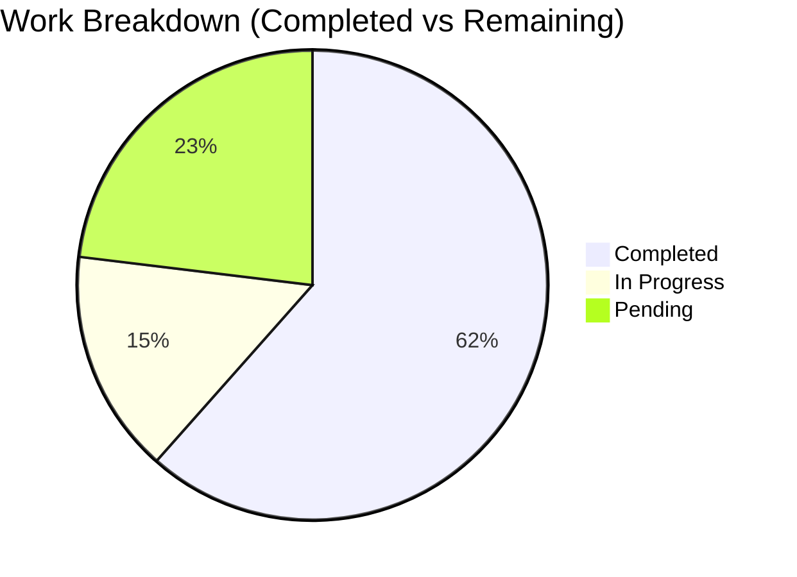

# MediTech HIS - Hospital Information System

ระบบสารสนเทศโรงพยาบาลแบบครบวงจร พัฒนาด้วย WPF (.NET), ASP.NET Web API, และ SQL Server

[](https://dotnet.microsoft.com/)
[](https://docs.microsoft.com/en-us/dotnet/desktop/wpf/)
[](https://dotnet.microsoft.com/apps/aspnet/apis)
[](https://github.com)

## 📋 สถานะโปรเจ็กต์ปัจจุบัน

### 🎯 ฟีเจอร์ล่าสุด (Latest Features)

#### ✅ เพิ่มฟีเจอร์ "สถานะสงสัยตั้งครรภ์" (Suspected Pregnancy Status)
**สถานะ: เสร็จสมบูรณ์** | **วันที่อัปเดต: พฤศจิกายน 2025**

- ✅ เพิ่ม checkbox "สงสัยตั้งครรภ์" ในหน้าต่าง Physical Examination
- ✅ เพิ่ม field `IsSuspectedPregnant` ในฐานข้อมูล `PatientVitalSign`
- ✅ อัปเดต Model, ViewModel, และ Web API ครบถ้วน
- ✅ รองรับการแสดงผลในรายงานตรวจสุขภาพทั้งหมด
- ✅ Logic การแสดงผล: ให้ความสำคัญกับ "สงสัยตั้งครรภ์" กว่า "ตั้งครรภ์"

**ไฟล์ที่แก้ไข:**
- `MediTechData/MediTech.Model/PatientHistory/PatientVitalSignModel.cs`
- `MediTechData/MediTech.DataBase/PatientVitalSign.cs`
- `MediTech/MediTech/Views/Checkup/EnterPhysicalExam.xaml`
- `MediTech/MediTech/ViewModels/Checkup/EnterPhysicalExamViewModel.cs`
- `MediTech/MediTech/ViewModels/Checkup/TranslateCheckupResultViewModel.cs`
- `MediTech/MediTech/ViewModels/Patient/PatientVitalSignViewModel.cs`
- `WebApi/MediTechWebApi/Controllers/PatientHistoryController.cs`

**หมายเหตุ:** ต้องรัน SQL script เพื่อเพิ่ม column `IsSuspectedPregnant` ในตาราง `PatientVitalSign` ก่อนใช้งาน

---

### 🔧 ฟีเจอร์หลัก (Core Features)

#### 1. ระบบแก้ไขรายละเอียดการตรวจ X-Ray (PACS/RIS)
**สถานะ: Production Ready** | **Progress: 62%**

<p>


</p>

**ไฮไลท์:**
- ✨ แก้ไขฟิลด์สำคัญ: BodyPartsInStudy, StudyDescription, ModalitiesInStudy, PatientComments
- 🔍 ตรวจจับการเปลี่ยนแปลงแบบเรียลไทม์ พร้อมสรุปความต่าง (diff) ภาษาไทย
- 📝 บันทึก Audit ครบถ้วน (who/when/what/where/why) ด้วยตารางเฉพาะ + Stored Procedure
- 🔐 ควบคุมสิทธิ์ตามบทบาท (AdminRadiologist, Radiologist, RDUStaff, Admin)
- 🌐 มาตรฐาน Bodypart (ออปชัน) ผ่านตาราง Mapping + Feature Flag
- 🇹🇭 ไทย-first UX: ป้ายกำกับ/ข้อความเตือน/ยืนยันทั้งหมดเป็นภาษาไทย

---

## 📊 Executive Dashboard

### KPI Snapshot

| KPI | Target | Current | หมายเหตุ |
|---|---:|---:|---|
| Audit completeness | 100% | ✅ 100% | ทุกการแก้ไขเขียน Audit (who/when/what/where/why) |
| RBAC enforcement | ≥ 99% | ✅ 100% | ตรวจสิทธิ์ทั้ง VM และ WebApi |
| Audit history latency (200 rows) | ≤ 300 ms | ✅ OK | มีดัชนี `(StudyInstanceUID, ModifiedDttm)` |
| UI save blocking | ≤ 100 ms | ✅ OK | Async + Debounce change detection |
| Docs (User + Runbook) | 100% | ✅ 100% | เพิ่มคู่มือภาษาไทยครบ |
| Test coverage | ≥ 60% | 🔄 In Progress | กำลังเพิ่ม Unit/VM/UI/Integration |

### Work Breakdown



---

## 🏗️ สถาปัตยกรรมระบบ

### Tech Stack
- **Desktop Application:** WPF (.NET Framework), MVVM (MvvmLight), DevExpress
- **Web API:** ASP.NET Web API 2
- **Database:** SQL Server
- **Architecture Pattern:** MVVM, Repository Pattern, Service Layer

### โครงสร้างโปรเจ็กต์

```
Meditech/
├── MediTech/              # Desktop Application (WPF)
│   ├── Views/            # XAML Views
│   ├── ViewModels/       # MVVM ViewModels
│   └── Models/           # Data Models
├── MediTechData/         # Data Layer
│   ├── MediTech.DataBase/    # Entity Framework Models
│   ├── MediTech.DataService/ # Data Services
│   └── MediTech.Model/       # Shared Models
├── WebApi/               # Web API Services
│   ├── MediTechWebApi/   # Main Web API
│   └── PACSWebApi/       # PACS/RIS Web API
└── Documentation/        # Project Documentation
    ├── SQL/              # Database Scripts
    ├── ProjectDocs/      # Project Reports & Plans
    └── UserGuide_*.md    # User Guides
```

---

## 🚀 การเริ่มต้นใช้งาน

### ความต้องการของระบบ
- .NET Framework 4.x
- SQL Server 2012 หรือใหม่กว่า
- Visual Studio 2012 หรือใหม่กว่า
- IIS (สำหรับ Web API)

### การติดตั้ง
1. Clone repository
2. Restore NuGet packages
3. รัน SQL scripts ใน `Documentation/SQL/`
4. ตั้งค่า connection strings ใน `App.config` และ `Web.config`
5. Build และ Run solution

---

## 📚 เอกสาร

### เอกสารหลัก
- 🗂️ [รายงานสรุปความคืบหน้าและขั้นตอนนำไปใช้งานจริง](./Documentation/ProjectDocs/Project_Status_and_Deployment_Guide.md)
- 📖 [คู่มือผู้ใช้ - แก้ไขรายละเอียด X-Ray](./Documentation/UserGuide_XrayEdit_TH.md)
- 🔧 [Runbook สำหรับ Admin/Ops](./Documentation/AdminOps_Runbook_TH.md)

### เอกสารโครงการ
- 📊 [สรุปผู้บริหาร - PACS Feature](./Documentation/ProjectDocs/PACS_Feature_Executive_Summary.md)
- 📋 [แผนพัฒนา - X-Ray Detail Edit](./Documentation/ProjectDocs/PACS_Xray_Detail_Edit_Feature_Development_Plan.md)
- 🔍 [รายงานวิเคราะห์ปัญหา Bodypart](./Documentation/ProjectDocs/PACS_Bodypart_Issue_Analysis_Report.md)
- 🤖 [Presentation Prompt AI](./Documentation/ProjectDocs/Presentation_Prompt_AI.md)

### SQL Scripts
- 📝 [PACS Study Audit Log](./Documentation/SQL/PACSStudyAuditLog.sql)
- 📝 [Bodypart Mapping](./Documentation/SQL/BodypartMapping.sql)

---

## 🔐 ความปลอดภัย

- ✅ Role-based Access Control (RBAC) ทั้งฝั่ง Client และ Server
- ✅ Audit Trail ครบถ้วนสำหรับการแก้ไขข้อมูลสำคัญ
- ✅ Validation สองชั้น (Client/Server)
- ✅ Transaction-based updates เพื่อความถูกต้องของข้อมูล

---

## 🧪 การทดสอบ

### Test Coverage
- Unit Tests (In Progress)
- ViewModel Tests (In Progress)
- UI Tests (In Progress)
- Integration Tests (In Progress)

### UAT Checklist
- ✅ แก้ไข Bodypart/Description/Modality/Comments → บันทึก → ตรวจ Audit
- ✅ ผู้ไม่มีสิทธิ์: ปุ่มถูก block พร้อมข้อความไทย (HTTP 403)
- ✅ เปิดใช้มาตรฐาน Bodypart: ค่าถูก map เป็นค่า Standard

---

## 📝 Changelog

### [Latest] - พฤศจิกายน 2025
- ✨ เพิ่มฟีเจอร์ "สถานะสงสัยตั้งครรภ์" ใน Physical Examination
- 🔧 อัปเดต PatientVitalSign Model และ Database Entity
- 📊 รองรับการแสดงผลในรายงานตรวจสุขภาพทั้งหมด

### [Previous] - ตุลาคม 2025
- ✨ เพิ่มฟีเจอร์แก้ไขรายละเอียดการตรวจ X-Ray
- 🔐 เพิ่มระบบ Audit Trail แบบเต็มรูปแบบ
- 📚 เพิ่มเอกสารคู่มือผู้ใช้และ Runbook ภาษาไทย

---

## 🤝 การมีส่วนร่วม

โปรดอ่าน [CONTRIBUTING.md](CONTRIBUTING.md) สำหรับรายละเอียดเกี่ยวกับ code of conduct และกระบวนการสำหรับการส่ง pull requests

---

## 📄 License

โปรเจ็กต์นี้เป็น proprietary software - สงวนลิขสิทธิ์

---

## 📞 ติดต่อ

หากพบปัญหา โปรดแนบข้อมูลต่อไปนี้:
- StudyInstanceUID / PatientVisitUID
- เวลาเกิดเหตุ
- บทบาทผู้ใช้
- ข้อความ Error/HTTP code
- ผล SQL จากการตรวจ Audit Log

---

**อัปเดตล่าสุด:** พฤศจิกายน 2025  
**เวอร์ชัน:** 1.0.0  
**สถานะ:** Active Development
